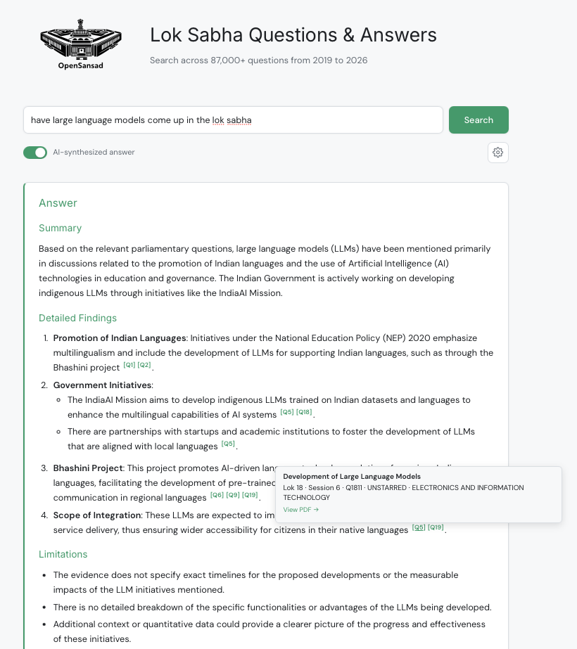
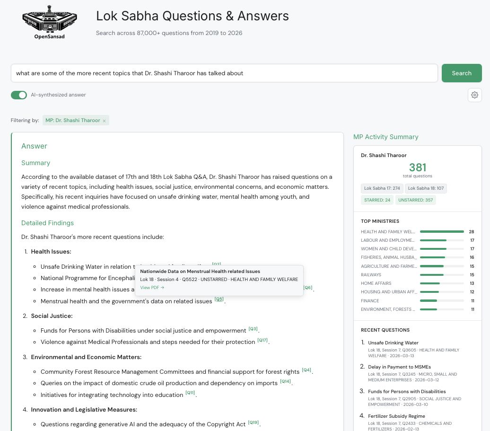
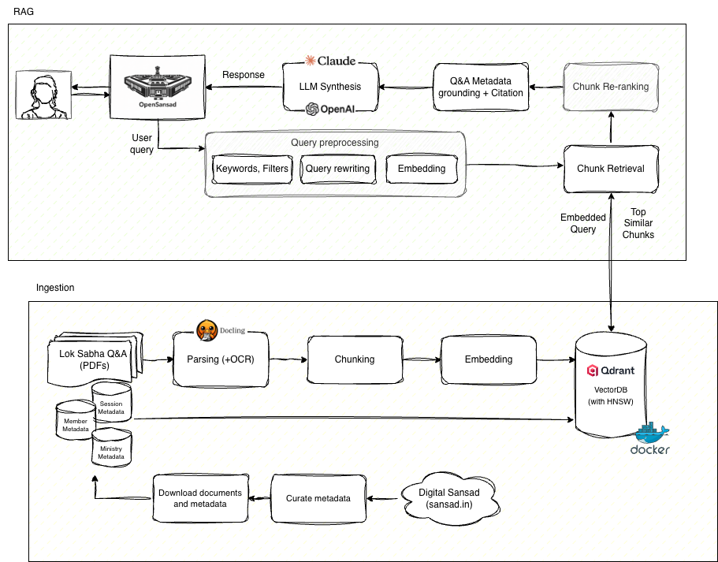

<p align="center">
  <picture>
    <source media="(prefers-color-scheme: dark)" srcset="docs/assets/OpenSansad_Logo_dark.svg">
    <source media="(prefers-color-scheme: light)" srcset="docs/assets/OpenSansad_Logo_light.svg">
    
  </picture>
</p>

<h1 align="center">OpenSansad — Lok Sabha Q&A RAG</h1>

<p align="center">
  <a href="LICENSE"></a>
</p>

<p align="center">
Ask Questions of Questions in the Lok Sabha. Bringing transparency to India's parliamentary proceedings by making Lok Sabha Q&A records searchable with Natural Language. Stretching to 89000+ questions from 2019 to 2026 so far and growing.
</p>

Part of the **OpenSansad** initiative — an effort to make Sansad's (Indian Parliament's) workings more accessible and transparent through open data and open-source tooling. Data sourced from [Digital Sansad](https://sansad.in/) via the [lok-sabha-dataset](https://github.com/sammitjain/lok-sabha-dataset) pipeline.

<p align="center">
  
</p>
<p align="center">
  
</p>

## Features

- **Semantic search** across 89,700+ parliamentary questions (Lok Sabha 16, 17 & 18)
- **AI-powered answer synthesis** with `[Q#]` citations back to source PDFs (GPT-4o-mini)
- **MP activity and Ministry activity statistics** from metadata database (question counts, ministry breakdowns)
- **Filter by** Lok Sabha number, session, ministry, or MP name

## Quick Start

### Prerequisites

- [Docker](https://docs.docker.com/get-docker/)

### Setup

```bash
git clone https://github.com/sammitjain/lok-sabha-rag.git && cd lok-sabha-rag
cp .env.example .env    # add your OPENAI_API_KEY
docker compose up
# Open http://localhost:8000
```

On first run, the app automatically downloads the pre-built vector database (~1.5 GB) and metadata from HuggingFace. Subsequent starts are instant.

> **Note:** Search and browsing work without an OpenAI key. The key is only needed for the AI-powered answer synthesis feature.

### Development Setup

For local development without Docker:

```bash
# Requires: Python 3.11+, uv, Docker (for Qdrant only)
bash scripts/setup.sh
uv run python main.py
```

## Architecture



```
src/lok_sabha_rag/
├── api/           # FastAPI routes (search, synthesize, stats, members, question-text)
├── core/          # Retriever (Qdrant), Synthesizer (OpenAI), Stats (SQLite)
├── prompts/       # LLM system + user prompt templates
└── pipeline/      # Chunk + embed (data sourced from HuggingFace dataset)
```

- **Vector DB**: Qdrant (384-dim BAAI/bge-small-en-v1.5 embeddings, cosine distance)
- **LLM**: GPT-4o-mini via OpenAI API
- **Data source**: [opensansad/lok-sabha-qa](https://huggingface.co/datasets/opensansad/lok-sabha-qa) on HuggingFace
- **Metadata**: SQLite database built from the HuggingFace dataset
- **Frontend**: Vanilla JS/CSS single-page app

## Related

- **[lok-sabha-dataset](https://github.com/sammitjain/lok-sabha-dataset)** — Upstream data pipeline (curate, download, extract, build, publish)
- **[opensansad/lok-sabha-qa](https://huggingface.co/datasets/opensansad/lok-sabha-qa)** — The published dataset on HuggingFace
