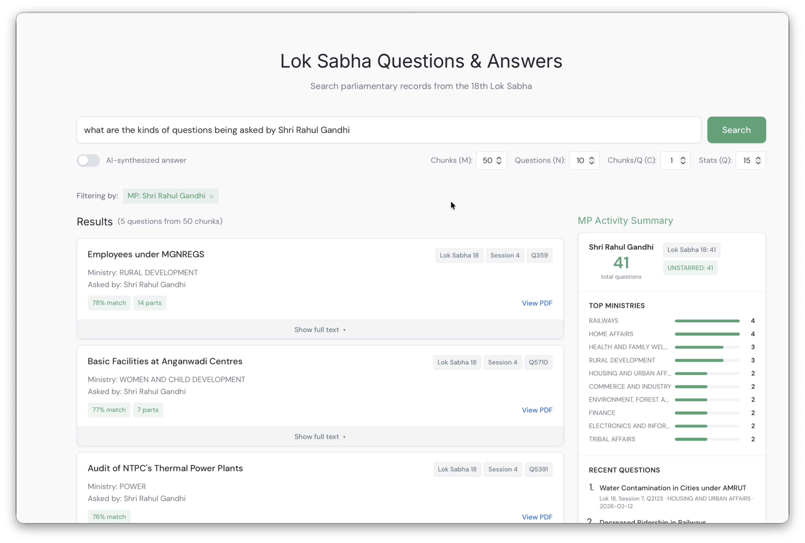
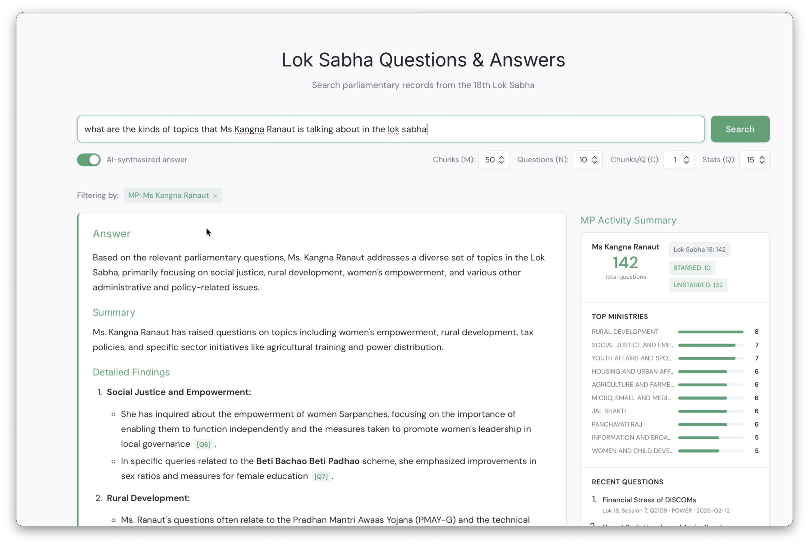

<p align="center">
  
</p>

<h1 align="center">OpenSansad — Lok Sabha Q&A RAG</h1>

<p align="center">
  A personal project to bring transparency to India's parliamentary proceedings by making Lok Sabha Q&A records searchable, explorable, and AI-augmented.
</p>

Part of the **OpenSansad** initiative — an effort to make Sansad's (Indian Parliament's) workings more accessible and transparent through open data and open-source tooling. Data sourced from [Digital Sansad](https://sansad.in/) via the [lok-sabha-dataset](https://github.com/sammitjain/lok-sabha-dataset) pipeline.




## Features

- **Semantic search** across 86,500+ parliamentary questions (Lok Sabha 17 & 18)
- **AI-powered answer synthesis** with `[Q#]` citations back to source PDFs (GPT-4o-mini)
- **MP activity statistics** from metadata database (question counts, ministry breakdowns)
- **Filter by** Lok Sabha number, session, ministry, or MP name
- **Lazy-loaded question text** — card content fetched on demand from Qdrant

## Quick Start

### Prerequisites

- Python 3.11+
- [uv](https://docs.astral.sh/uv/) package manager
- [Docker](https://docs.docker.com/get-docker/) (for Qdrant vector database)
- OpenAI API key (for AI synthesis mode)

### Setup

```bash
git clone <repo-url> && cd lok-sabha-rag
./scripts/setup.sh
# Edit .env to add your OPENAI_API_KEY
uv run python main.py
# Open http://localhost:8000
```

### Manual Setup

```bash
cp .env.example .env              # add your OPENAI_API_KEY
uv sync                           # install Python dependencies
docker compose up -d               # start Qdrant on localhost:6333

# Restore Qdrant snapshot (ships a starter collection)
# OR build from HuggingFace dataset:
uv run python -m lok_sabha_rag.pipeline.build_chunks_bge --max-files 50 --data-dir data/sample
uv run python -m lok_sabha_rag.pipeline.embed --data-dir data/sample

# Start server
uv run python main.py             # http://localhost:8000
```

## Architecture

```
src/lok_sabha_rag/
├── api/           # FastAPI routes (search, synthesize, stats, members, question-text)
├── core/          # Retriever (Qdrant), Synthesizer (OpenAI), Stats (SQLite)
├── prompts/       # LLM system + user prompt templates
└── pipeline/      # Chunk + embed (data sourced from HuggingFace dataset)
```

- **Vector DB**: Qdrant (384-dim BAAI/bge-small-en-v1.5 embeddings, cosine distance)
- **LLM**: GPT-4o-mini via OpenAI API
- **Data source**: [opensansad/lok-sabha-qa](https://huggingface.co/datasets/opensansad/lok-sabha-qa) on HuggingFace
- **Metadata**: SQLite database built from the HuggingFace dataset
- **Frontend**: Vanilla JS/CSS single-page app

See [docs/ARCHITECTURE.md](docs/ARCHITECTURE.md) for the full reference.

## Data Pipeline

This repo handles the **downstream** RAG pipeline — chunking and embedding. The upstream data pipeline (curate, download, extract, build parquet) lives in [lok-sabha-dataset](https://github.com/sammitjain/lok-sabha-dataset).

```
HuggingFace dataset (opensansad/lok-sabha-qa)
  → build_chunks_bge.py   # tokenizer-aware splitting (BGE tokenizer, 500 token max)
  → embed.py              # embed with FastEmbed, upsert to Qdrant
```

## Documentation

The `docs/` directory contains a project knowledge base:

| File | Contents |
|------|----------|
| [ARCHITECTURE.md](docs/ARCHITECTURE.md) | Tech stack, directory tree, data flow |
| [BACKEND.md](docs/BACKEND.md) | API routes, core modules, schemas |
| [FRONTEND.md](docs/FRONTEND.md) | JS functions, CSS variables, UI behavior |
| [DATA_PIPELINE.md](docs/DATA_PIPELINE.md) | Pipeline stages, data layout, Qdrant schema |

## Related

- **[lok-sabha-dataset](https://github.com/sammitjain/lok-sabha-dataset)** — Upstream data pipeline (curate, download, extract, build, publish)
- **[opensansad/lok-sabha-qa](https://huggingface.co/datasets/opensansad/lok-sabha-qa)** — The published dataset on HuggingFace
